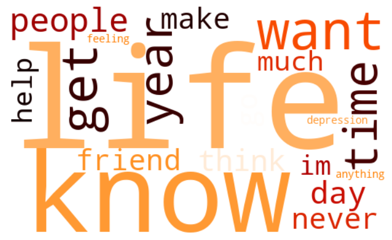
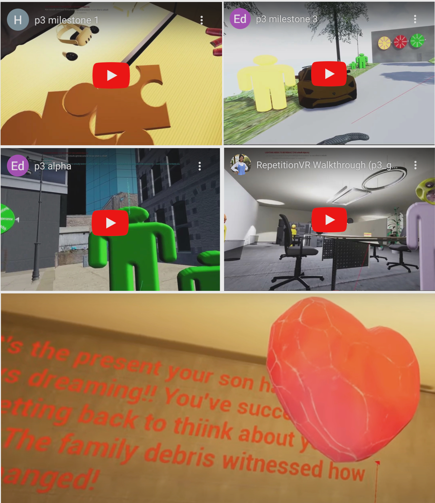
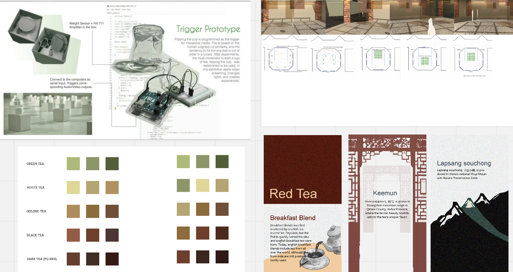
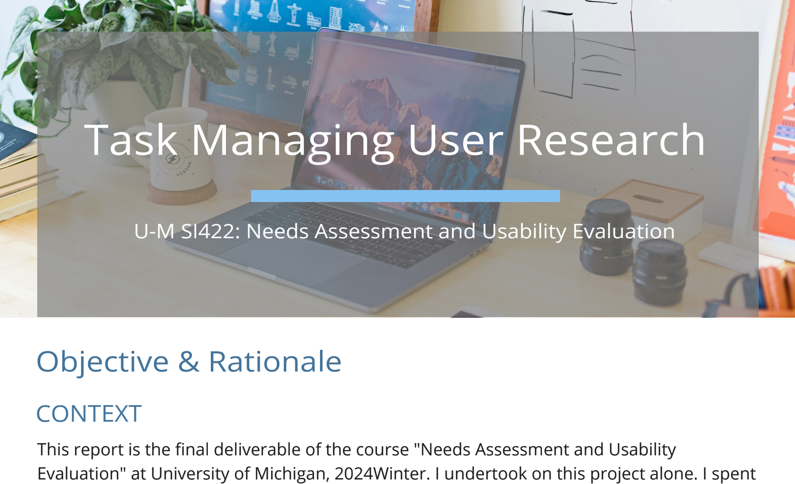

### Interests & Hobbies

Outside of research, I love indoor climbing, pickleball, anime, meditation, matcha, and spending time with my two cats.

### Selected Projects

#### Analyzing Emotional Expression and Engagement Dynamics in Reddit Communities

*#Social Computing  #Computational Social Science  #Social Media*
[[View Report]](https://drive.google.com/file/d/1hz3FBRZG1L-cRSwyW6QCG1xK6E473ZXH/view?usp=sharing)

#### RepetitionVR: A VR Simulator to Overcome Social Anxiety and Isolation

*#Extended reality  #Game design  #Unreal engine*
[[View Report]](https://sites.google.com/umich.edu/repetvr/home)

#### Interactive Exhibition: Worldwide Tea

*#Participatory design  #Internet of Things  #Installation art*
[[View Report]](https://drive.google.com/file/d/1iqp5Fp0SFmDlz_MnKCJuOydVO1VCyhs8/view?usp=sharing)

#### User Study Report: Task Managing Behavior

*#User experience  #Journey map  #User study*
[[View Report]](https://drive.google.com/file/d/1x-Kj_3XsDhu0BImWnxdzMAd7tSoUC8Lb/view?usp=sharing)
